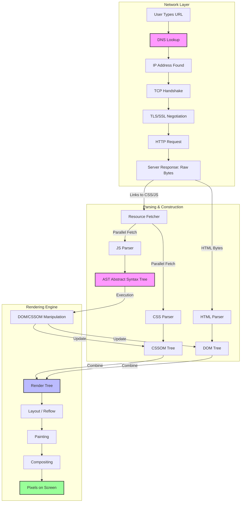
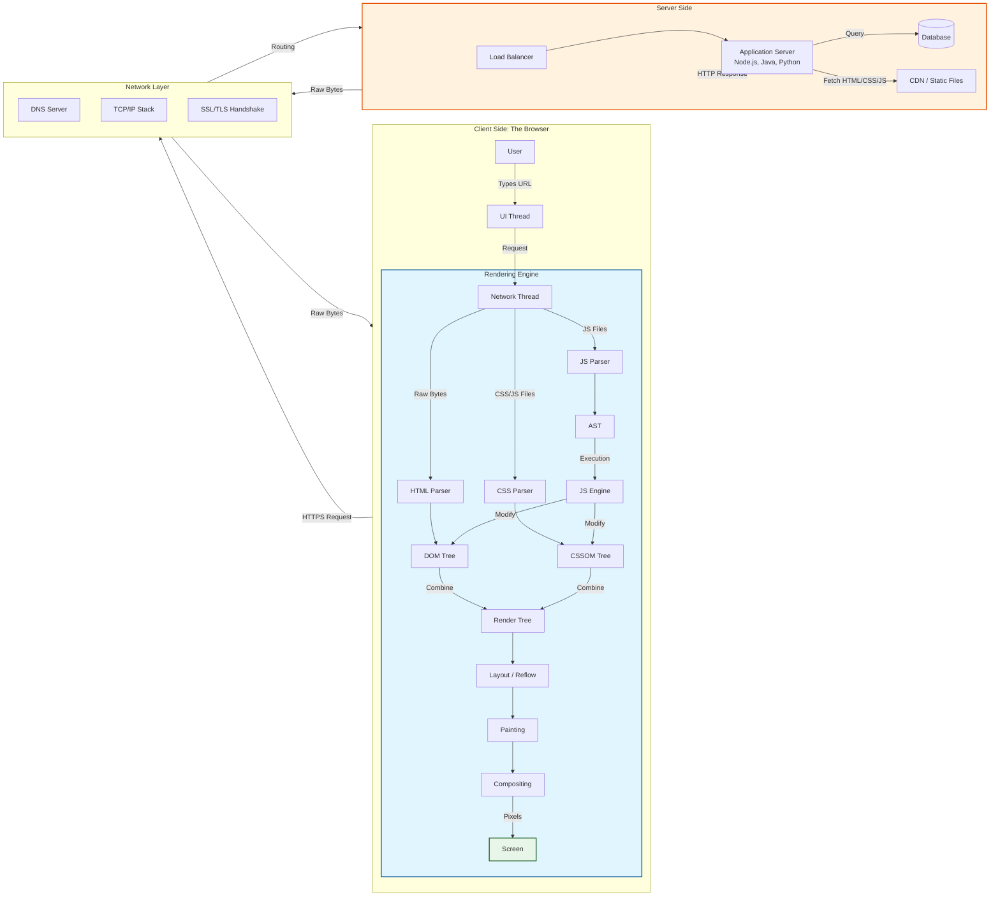

# The Critical Rendering Path: Complete Guide

## 1. Architectural Diagram

### 🏗️ Parsing & Construction

| Step | Description | Official Documentation |
| :--- | :--- | :--- |
| **HTML Parser** | Converting bytes to the **DOM**. | [MDN: DOM Introduction](https://developer.mozilla.org/en-US/docs/Web/API/Document_Object_Model/Introduction) |
| **CSS Parser** | Converting CSS to the **CSSOM**. | [MDN: CSS Object Model](https://developer.mozilla.org/en-US/docs/Web/API/CSS_Object_Model) |
| **JS Parser (AST)** | Converting JS code to an **Abstract Syntax Tree**. | [MDN: AST](https://developer.mozilla.org/en-US/docs/Glossary/AST) |
| **Resource Fetcher** | How browsers download files in parallel. | [web.dev: Resource Hints](https://web.dev/articles/resource-hints) |

### 🎨 Rendering Engine

| Step | Description | Official Documentation |
| :--- | :--- | :--- |
| **Render Tree** | Combining DOM + CSSOM (Visible nodes only). | [web.dev: Critical Rendering Path](https://web.dev/articles/critical-rendering-path) |
| **Layout (Reflow)** | Calculating size and position. | [MDN: Layout](https://developer.mozilla.org/en-US/docs/Web/CSS/CSS_layout) |
| **Painting** | Filling in pixels (colors, text). | [MDN: Paint](https://developer.mozilla.org/en-US/docs/Web/API/Canvas_API/Tutorial/Drawing_shapes) |
| **Compositing** | Drawing layers in order. | [web.dev: Compositing](https://web.dev/articles/compositing) |

## 3. Key Concepts Explained

### Why is the AST important?
The **Abstract Syntax Tree (AST)** is the internal representation of your JavaScript code. Before the browser can run your code, it must parse the text into this tree structure.
*   **Relevance**: If your JavaScript file is huge, the time spent generating the AST delays the execution of your code, which can block the Critical Rendering Path.
*   **Optimization**: Minify your code to reduce the size of the AST.

### Parallel Fetching vs. Sequential Execution
*   **Parallel**: The browser downloads HTML, CSS, and JS files at the same time.
*   **Sequential**: The browser usually waits for CSS before painting, and waits for JS (unless `async`/`defer`) before finishing the DOM.

### How to Optimize
1.  **Inline Critical CSS**: Put the CSS for the "above the fold" content directly in the HTML to skip a network request.
2.  **Defer Scripts**: Use `<script defer>` so JavaScript doesn't block the HTML parser.
3.  **Minify**: Reduce file sizes to speed up parsing (AST generation).
4.  **Preconnect**: Use `<link rel="preconnect">` to start DNS/TLS handshakes early.
